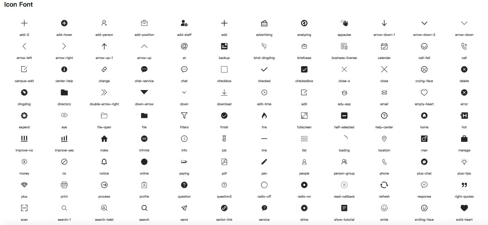

# Aut - IconFont

基于svg生成字体图标

## 使用说明

- 将切图的svg文件放入`assets/svg`目录下，执行`npm run build`命令可将svg文件编译成`iconfont`字体图标，文件名即为生成的`iconfont`类名，注意svg命名**采用英文切忌中文和中文拼音缩写**

- `src/config`文件可自定义配置图标字体和Css样式类前缀

- 编译后生成`lib`文件夹，图标字体的格式类似于阿里的[iconfont](https://www.iconfont.cn/)生成的文件

> CDN引入方式暂不支持

## 发版

打开`dist/demo.html`文件确保所有的图标都是对的，然后在项目根目录下运行：

```bash
$ npm run release
```

### 图标字体

